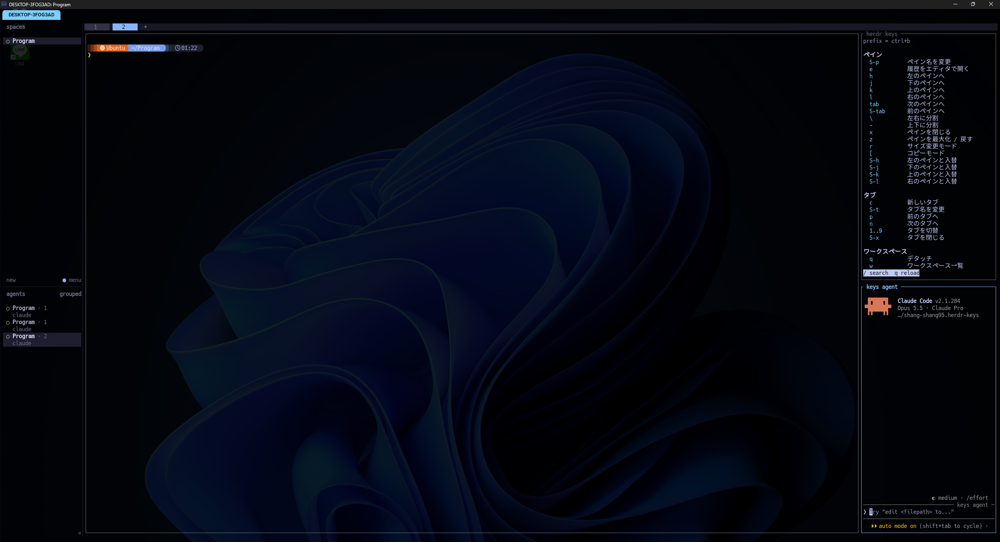

# herdr-keys

[herdr](https://herdr.dev) のタブの右に、いま使えるキーの一覧と、キーについて質問できる AI (Claude Code) を常に表示するプラグインです。

- **herdr keys**: シェルなどにフォーカス中は herdr のキー
- **editor keys**: Neovim にフォーカス中はその Neovim のキー (Vim / Avante / NeoVim / LazyVim)
- **keys agent**: 「〇〇をするには？」と聞くと、表示中の一覧から押すキーを答える

キーは実際の設定から読み取ります。説明は日本語です。



## 前提

- OS: Linux または WSL
- ソフトウェア: [herdr](https://herdr.dev) と [Neovim](https://neovim.io)

作者の環境は WSL + WezTerm + LazyVim + avante.nvim です。他の環境では表示が崩れたり動かない部分があるかもしれません。修正の Pull Request を歓迎します。

keys agent は一覧をもとに答えるだけです。権限はファイルの読み取り (Read) のみで、ファイルの編集やコマンドの実行はできません。

## 必要なもの

- herdr 0.9 以上
- python3 3.11 以上、`less`、`strings` (binutils)、`jq`
- editor keys: Neovim 0.10 以上 (LazyVim / avante.nvim が無ければ、そのキーが出ないだけ)
- keys agent: [Claude Code](https://claude.com/claude-code) と claude.ai へのログイン

## インストール

### 1. プラグイン

```sh
herdr plugin install shang-shang95/herdr-keys
```

次の herdr 起動時から、各タブ (新しいタブも) に自動で開きます。

### 2. キーバインド (任意)

閉じたあと開き直すキーです。`~/.config/herdr/config.toml` に追加します。

```toml
[[keys.command]]
key = "prefix+i"
type = "shell"
command = "herdr plugin action invoke open --plugin shang-shang95.herdr-keys"
description = "キー一覧を右に開く"

[[keys.command]]
key = "prefix+a"
type = "shell"
command = "herdr plugin action invoke ask --plugin shang-shang95.herdr-keys"
description = "keys agent を開く"
```

既に開いていれば何もしません。herdr のアクション一覧の `Open keys pane` / `Open keys agent` からも開けます。

### 3. Neovim (editor keys を使う場合)

[`nvim/herdr-keys.lua`](nvim/herdr-keys.lua) を Neovim の設定に追加します (LazyVim なら `lua/config/autocmds.lua` の末尾)。

### 4. avante.nvim の選択範囲のキー (任意)

LazyVim の avante extra は `<leader>aa` / `<leader>ae` をノーマルモードにしか割り当てません。範囲選択して使うには次を追加します。

```lua
-- ~/.config/nvim/lua/plugins/avante.lua
return {
  {
    "yetone/avante.nvim",
    keys = {
      { "<leader>aa", function() require("avante.api").ask() end, mode = "v", desc = "Ask Avante" },
      { "<leader>ae", function() require("avante.api").edit() end, mode = "v", desc = "Edit Avante" },
    },
  },
}
```

## keys agent にできること

- 表示中の一覧を読んで、押すキーを答えます。
- 使える道具は Read のみです。編集・コマンド実行・git 操作は頼まれても手順の説明だけです。
- Claude Code のユーザー設定 (フック・プラグイン・MCP) は読み込みません。
- 初回だけ、状態ディレクトリを信頼するかの確認が出ます。

## 仕組み

変化があったときだけ描き直します (ポーリングなし)。

| ファイル | 役割 |
|---|---|
| `herdr-plugin.toml` | プラグインの定義 |
| `startup.sh` | キー一覧と keys agent を開く |
| `keys.py` | 一覧を `less` で表示。SIGUSR1 / SIGUSR2 で描き直す |
| `focus.sh` | フォーカス移動時に一覧へ SIGUSR2 を送る |
| `ask.sh` | keys agent (`claude --tools Read`) の起動 |
| `nvim/herdr-keys.lua` | Neovim のキーマップを書き出して SIGUSR1 を送る |

状態は `~/.local/state/herdr/plugins/shang-shang95.herdr-keys/` に置きます。

## カスタマイズ

表示するキーと説明は `keys.py` の先頭で決めています。

- `NVIM_PICK`: editor keys のキーと説明
- `HERDR_JA` / `GROUPS`: herdr keys の説明と見出し

変更後は `python3 keys.py --check` で確認できます。

## ライセンス

[MIT](LICENSE)
